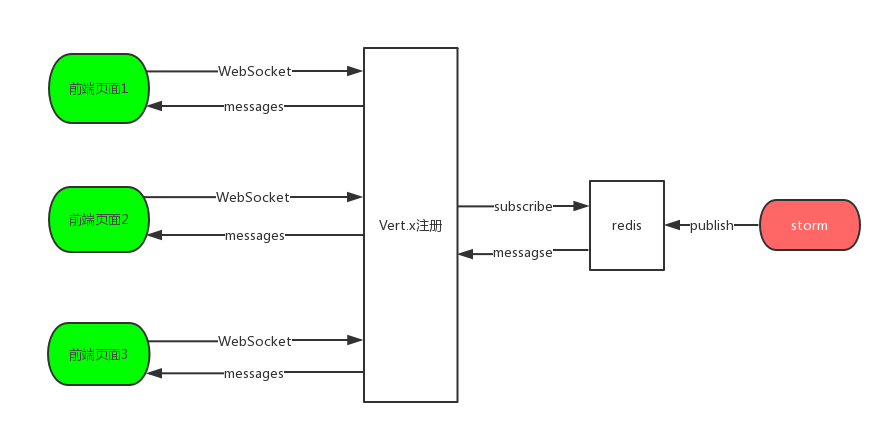

# redis_publish
<!--TOC-->
- [1 介绍](#1-介绍)
  - [1.1 功能介绍](#11功能介绍)
  - [1.2 数据流图](#12-数据流图)
  - [1.3 相关文档](#13-相关文档)
- [2 安装运行](#2-安装运行)
  - [2.1 环境依赖](#21-环境依赖)
  - [2.2 配置文件说明](#22-配置文件说明)
  - [2.3 运行](#23-运行)
    - [2.3.1 检查工作](#231-检查工作)
    - [2.3.2 运行步骤](#232-运行步骤)

# 1 介绍
## 1.1 功能介绍
  本项目使用[Vert.x](http://vertx.io)框架,与前端建立一个连接（本质上是websocket）。同时实时监听redis上建立的一个频道，每当后台向该频道推送一条消息，Vert.x会同时将这一条消息转发到前端页面。
## 1.2 数据流图

## 1.3 相关文档
  - [Vert.x文档](http://vertx.io/docs/)
  - [redis的java接口使用](https://github.com/xetorthio/jedis)


# 2 安装运行
```bash
#安装Redis服务器端
$ sudo apt-get install redis-server

# 检查Redis服务器系统进程
$ ps -aux|grep redis

hadoop    6846  0.0  0.0  15980  2212 pts/2    S+   16:44   0:00 grep --color=auto redis
hadoop    7737  0.0  0.0  44068  7408 ?        Sl    1月18   2:01 redis-server *:6379
hadoop   21421  0.0  0.6 20919452 458236 ?     Sl    1月20   4:45 java -cp VertRedisClient.jar com.wangrupeng.main.VertSocket vert_redis.json

# 通过启动命令检查Redis服务器状态
$ netstat -nlt|grep 6379

tcp        0      0 127.0.0.1:6379          0.0.0.0:*               LISTEN

# 通过启动命令检查Redis服务器状态
$ sudo /etc/init.d/redis-server status

redis-server is running
```

## 2.1 环境依赖
  - java1.8
  - redis v4.0
  - Vert.x v3.5

## 2.2 配置文件说明
- redis.json

配置项 | 说明
--- | ---
redis_host | redis访问ip地址
redis_port | redis访问端口
channel | redis发布消息的频道
vert_port | Vertx监听端口
redis_author | redis密码
logDir | 日志地址


## 2.3 运行

### 2.3.1 检查工作
```bash
#检查程序是否已经在运行
$ jps

#如果有名为VertSocket的进程则代表程序已经在运行
#可以选择杀死该进程在重新启动
kill -9 [pid]

#不可以重复启动，否则会造成信息重复
```

### 2.3.2 运行步骤
``` bash
#打包
#这里不做详细说明 VertRedisClient.jar

#运行
java -cp com.oceanai.main.VertSocket VertRedisClient.jar vert_redis.json
```
